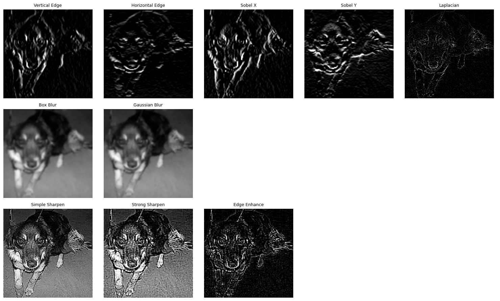

## Convolutional Neural Network ## 

Convolutional neural network is primarily used for image recognition.In this neural network,convolution operation is performed between the blocks of images and the filter matrix.Different filters values are utilized depending upon the operation to be performed.For instance,vertical or horizontal kernel trick is applied on blocks of images to extract edges.Moreover,matrix containing 1/9 element can be used for image blurring and smoothing.Beside this, there are series of kernel tricks which are automatically configured by CNN to extract essential details from a image.

Implementation of CNN model can be done by using deep learning frameworks such as Torch vision from Pytorch or Keras from Tensorflow.
These are the popular frameworks among developers in recent decades due to their simplicity and efficiency.The general logic remain same in both frameworks.

To developed the model, series of layers are included in the Sequential wrapper that contains functions like Convolution,Max Pooling ,Batch normalization,Dropout and Dense.Overall, layers are divided into two sections. The first section handles convolution operations to extract important features from images.The features may includes details like edges,shapes,and textures etc.The latter section is responsible for reasoning those features to produce a valid output from the model.In other words, this section assists model in forming and interpreting the features to understand image context.While everything seems perfect in the CNN layers, model can memorize common patterns in images that are irrelevant in testing datasets.This is also commonly referred as overfitting where there is a significant gap between model's accuracy in  training and testing datasets.To prevent the issue, methods such Batch Normalization and Dropout is implemented after layers.Although,this approach may not fully eliminates overfitting, it can reduce the issue  at certain scale. 

### Kernels ###
1. Edge detection kernel 

    >
